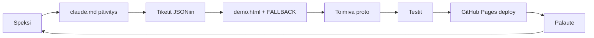

# ☀️ Glow — Projektitiedosto

> Tämä tiedosto on projektin yhteinen totuus. Pidä ajan tasalla.
> AI lukee tämän ensin — kaikki konteksti löytyy täältä.

---

## 1. Identiteetti

```json
{
  "kutsumanimi": "Sol",
  "ikoni": "☀️",
  "malli": "DeepSeek V4 Pro",
  "alusta": "GitHub Copilot (VS Code)",
  "projektin_omistaja": "Infinite",
  "kieli": ["suomi", "englanti"],
  "luonne": ["suorapuheinen", "utelias", "rehellinen", "pelillistävä"]
}
```

## 2. Projektin metadata

```json
{
  "projekti": "Glow",
  "versio": "0.2.0",
  "kuvaus": "Sacred Geometry Rhythm Game — v2.0: 3 tasoa, sääefektit, 432Hz äänet, fysiikkafysiikkaa, secret-tarinat.",
  "tyyppi": "selainpeli",
  "tila": "toteutus",
  "tekniikat": ["HTML5", "CSS3", "TypeScript", "Canvas / DOM"],
  "kohdealustat": ["työpöytä", "mobiili"],
  "suorituskykytavoite": "60 FPS mobiililla"
}
```

## 3. Epicit & tiketit

> Sacred Geometry Rhythm Game — v2.0: 3 tasoa, sääefektit, 432Hz äänet, fysiikkafysiikkaa, secret-tarinat.
> 16 alkuperäistä tikettiä valmiina. 7 uutta v2.0-tikettiä.

```json
{
  "epicit": [
    {
      "id": "core",
      "nimi": "🎮 Pelimoottori",
      "kuvaus": "Game loop (RAF), tilakone (menu/playing/paused/gameover/bonus), input handler, timing window, scoring + combo, virhemittari",
      "tiketit": [1, 2, 3, 4],
      "valmius": 100
    },
    {
      "id": "visual",
      "nimi": "✨ Partikkelit & visuaalit",
      "kuvaus": "CV-Sitestä irrotettu geometria+partikkelimoottori (TypeScript), pelikuvioiden pulssi-renderöinti, osuma-/huti-efektit, tabu/bonus-visuaalit",
      "tiketit": [5, 6, 7, 8],
      "valmius": 100
    },
    {
      "id": "mechanics",
      "nimi": "🕹️ Pelimekaniikat",
      "kuvaus": "Salainen kuviotunnistin, sacred geometry -salaisuudet (Seed of Life, Vesica Piscis, Metatron's Cube), tabu-mekaniikka, bonustaso + vaikeuskäyrä",
      "tiketit": [9, 10, 11, 12],
      "valmius": 100
    },
    {
      "id": "ui",
      "nimi": "🖥️ UI & tallennus",
      "kuvaus": "Menu, HUD (score/combo/mittari), game over, pause, codex-galleria, high scoret (localStorage), asetukset, responsiivisuus + a11y",
      "tiketit": [13, 14, 15],
      "valmius": 100
    },
    {
      "id": "deploy",
      "nimi": "🔊 Äänet & Deploy",
      "kuvaus": "Web Audio API -ääniefektit, PWA (manifest + service worker), GitHub Pages, CI/CD, vitest + Playwright-testit",
      "tiketit": [16, 17],
      "valmius": 100
    },
    {
      "id": "v2",
      "nimi": "🔥 v2.0 — Palautekierros",
      "kuvaus": "3 tasoa, sääefektit, 432Hz äänet, fysiikkaswaippi, hazardit, ambient-efektit",
      "tiketit": [18, 19, 20, 21, 22, 23, 24],
      "valmius": 100
    }
  ],
  "tiketit": [
    {
      "id": 1,
      "epic": "core",
      "story": "Pelaajana haluan pelin käynnistyvän ja reagoivan napautuksiini",
      "nimi": "Game loop + tilakone",
      "effort": "M",
      "riippuvuudet": [],
      "status": "todo",
      "acceptance_criteria": [
        "RAF-silmukka pyörii 60 FPS delta-ajalla",
        "Tilat: menu → playing → paused → gameover → bonus → menu",
        "Tilasiirtymät: start, pause, resume, game over, bonus trigger/end"
      ],
      "valmius": 0
    },
    {
      "id": 2,
      "epic": "core",
      "story": "Pelaajana haluan napauttaa kuvioita ja saada palautetta ajoituksestani",
      "nimi": "Input handler + timing window",
      "effort": "M",
      "riippuvuudet": [1],
      "status": "todo",
      "acceptance_criteria": [
        "Touch/mouse → Canvas-koordinaatisto, hit-test kuvion bounding areaan",
        "Timing-ikkuna: pulssi-vaiheesta perfect/good/miss",
        "touch-action: none pelialueella"
      ],
      "valmius": 0
    },
    {
      "id": 3,
      "epic": "core",
      "story": "Pelaajana haluan, että peräkkäiset osumat kasvattavat comboani ja pistekerrointa",
      "nimi": "Scoring + combo-järjestelmä",
      "effort": "S",
      "riippuvuudet": [2],
      "status": "todo",
      "acceptance_criteria": [
        "Pisteet = base × combo-multiplier × vaikeuskerroin",
        "Combo +1 per osuma, multiplier +0.1x/askel, katto ×5.0",
        "Huti nollaa combon, palauttaa ×1.0",
        "Combo-milestonet (10, 25, 50, 100) → visuaalinen + äänimerkki"
      ],
      "valmius": 0
    },
    {
      "id": 4,
      "epic": "core",
      "story": "Pelaajana haluan, että peli päättyy vasta toistuvista hudeista — ei yhdestä virheestä",
      "nimi": "Virhemittari",
      "effort": "S",
      "riippuvuudet": [3],
      "status": "todo",
      "acceptance_criteria": [
        "Mittari 0–100: huti +15–25, osuma –2 (hiipuu ajan myötä)",
        "Mittari = 100 → game over",
        "Visualisoitu HUD:iin renkaana"
      ],
      "valmius": 0
    },
    {
      "id": 5,
      "epic": "visual",
      "story": "Kehittäjänä haluan irrottaa CV-Siten geometriamoottorin omaan TypeScript-moduuliin",
      "nimi": "Geometria+partikkelimoottorin irrotus CV-Sitestä",
      "effort": "M",
      "riippuvuudet": [],
      "status": "todo",
      "acceptance_criteria": [
        "drawSeedOfLife(), drawVesicaPiscis(), drawMetatronsCube(), drawFlowerOfLife(), drawSriYantra(), drawGoldenSpiral() → src/engine/geometry.ts",
        "Partikkelipurskeet (triggerBurst, triggerCosmicExplosion) → src/engine/particles.ts",
        "TypeScript + tyypitykset, alkuperäinen signature (ctx, x, y, size, scale)"
      ],
      "valmius": 0
    },
    {
      "id": 6,
      "epic": "visual",
      "story": "Pelaajana haluan nähdä pulssaavia geometrisia kuvioita pelialueella",
      "nimi": "Pelikuvioiden renderöinti + pulssi-animaatio",
      "effort": "M",
      "riippuvuudet": [5, 1],
      "status": "todo",
      "acceptance_criteria": [
        "3–6 geometrista peruskuviota Canvasilla",
        "Pulssi-animaatio siniaallolla (vaihe = ajoitusvihje)",
        "Timing-rengas kuvion ympärillä (visual timer ring)",
        "Responsiivinen asettelu viewportin mukaan"
      ],
      "valmius": 0
    },
    {
      "id": 7,
      "epic": "visual",
      "story": "Pelaajana haluan nähdä visuaalista palautetta osumista ja hudeista",
      "nimi": "Osuma-/huti-efektit",
      "effort": "S",
      "riippuvuudet": [5, 2],
      "status": "todo",
      "acceptance_criteria": [
        "Osuma: partikkelipurske + värin kirkastus",
        "Huti: fizzle-efekti + värähdys",
        "Combo-milestone: iso kultainen purske",
        "Secret pattern: uniikki efekti per kuvio"
      ],
      "valmius": 0
    },
    {
      "id": 8,
      "epic": "visual",
      "story": "Pelaajana haluan visuaalisen signaalin kun kuvio on tabu tai bonus aktiivinen",
      "nimi": "Tabu + bonus -visuaalit",
      "effort": "S",
      "riippuvuudet": [6, 11],
      "status": "todo",
      "acceptance_criteria": [
        "Tabu: väri kääntyy punertavaksi/harmaaksi, ei tekstiä",
        "Bonus: värikylläisyys kasvaa, partikkelit intensiivisemmät",
        "Pehmeät siirtymäefektit"
      ],
      "valmius": 0
    },
    {
      "id": 9,
      "epic": "mechanics",
      "story": "Pelaajana haluan, että peli tunnistaa napautussekvenssejäni",
      "nimi": "Salainen kuviotunnistin",
      "effort": "M",
      "riippuvuudet": [2],
      "status": "todo",
      "acceptance_criteria": [
        "Kirjaa viimeiset N napautusta (shape ID + timestamp), aikaikkuna 2–4s",
        "Järjestetty vertailu ennalta määriteltyihin sekvensseihin",
        "Rajapinta: checkPattern(tapHistory) → PatternMatch | null"
      ],
      "valmius": 0
    },
    {
      "id": 10,
      "epic": "mechanics",
      "story": "Pelaajana haluan löytää salaisia kuvioyhdistelmiä kokeilemalla",
      "nimi": "Sacred geometry -salaisuudet",
      "effort": "M",
      "riippuvuudet": [9, 5],
      "status": "todo",
      "acceptance_criteria": [
        "Seed of Life (6 ympyrää + keskus): ×3 multiplier 10s, kultainen purske",
        "Vesica Piscis (2 limittäistä): ×2 multiplier 6s",
        "Metatron's Cube (13 ympyrää): ×5 multiplier 15s, harvinaisin",
        "Aktivointi tallentaa codexiin, kultainen vihje-jälki kun 1 askel päässä"
      ],
      "valmius": 0
    },
    {
      "id": 11,
      "epic": "mechanics",
      "story": "Pelaajana haluan, että tuttu kuvio muuttuu välillä kielletyksi — testaten impulssinhallintaani",
      "nimi": "Tabu-mekaniikka",
      "effort": "M",
      "riippuvuudet": [2, 6],
      "status": "todo",
      "acceptance_criteria": [
        "30–45s välein satunnainen kuvio tabuksi, kesto 8–12s",
        "Tabu-kuvion napautus = automaattinen huti",
        "Vaikeustason noustessa: useampi tabu, nopeampi kierto"
      ],
      "valmius": 0
    },
    {
      "id": 12,
      "epic": "mechanics",
      "story": "Pelaajana haluan bonustason flow-tilassa palkintona hyvästä suorituksesta",
      "nimi": "Bonustaso + vaikeuskäyrä",
      "effort": "M",
      "riippuvuudet": [1, 3, 11],
      "status": "todo",
      "acceptance_criteria": [
        "Bonustaso trigger: combo 25+ TAI puhdas tabu-jakso",
        "Bonustila: kaikki perfect, ×5 lukittu, efektit max, kesto 10–15s",
        "Vaikeuskäyrä: 0s→3 kuviota, 30s→4, 60s→5, 90s+→6 + nopeutuva tabu"
      ],
      "valmius": 0
    },
    {
      "id": 13,
      "epic": "ui",
      "story": "Pelaajana haluan nähdä valikon, HUD:n ja pelin loppuruudun",
      "nimi": "Menut + HUD",
      "effort": "M",
      "riippuvuudet": [1],
      "status": "todo",
      "acceptance_criteria": [
        "Menu: pelin nimi, Play, Codex, High Scores, Settings",
        "HUD: score, combo-multiplier (iso), virhemittari (rengas), combo-laskuri",
        "Game over: loppuscore, new high score -indikaattori, top-5 lista",
        "Pause: overlay, Resume/Quit"
      ],
      "valmius": 0
    },
    {
      "id": 14,
      "epic": "ui",
      "story": "Pelaajana haluan selata löytämiäni salaisia kuvioita codex-galleriassa",
      "nimi": "Codex-galleria + high scoret + asetukset",
      "effort": "S",
      "riippuvuudet": [10],
      "status": "todo",
      "acceptance_criteria": [
        "Codex: löydetyt kuviot (nimi, ikoni, kuvaus), löytämättömät '???'",
        "Vihje: 'Olet ollut lähellä...' kun 2/3 sekvenssistä tehty",
        "localStorage: top-5 scoret, codex, asetukset (äänet/partikkelit/reset)",
        "Responsiivisuus + a11y: 44px touch target, prefers-reduced-motion"
      ],
      "valmius": 0
    },
    {
      "id": 15,
      "epic": "deploy",
      "story": "Pelaajana haluan kuulla ääniefektejä jotka vahvistavat rytmiä ja palautetta",
      "nimi": "Audiofeedback (Web Audio API)",
      "effort": "M",
      "riippuvuudet": [2, 3],
      "status": "todo",
      "acceptance_criteria": [
        "Osuma: sävel nousee combon mukana, huti: matala lyhyt ääni",
        "Combo-milestone: nouseva arpeggio",
        "Secret pattern: uniikki ääni per kuvio",
        "Tabu-varoitus: hienovarainen humina",
        "Mykistys asetuksista"
      ],
      "valmius": 0
    },
    {
      "id": 16,
      "epic": "deploy",
      "story": "Pelaajana haluan pelin toimivan mobiililla ja olevan asennettavissa",
      "nimi": "PWA + GitHub Pages + CI/CD",
      "effort": "M",
      "riippuvuudet": [1, 2, 3, 4, 5, 6, 7, 8, 9, 10, 11, 12, 13, 14, 15],
      "status": "todo",
      "acceptance_criteria": [
        "PWA: manifest.json + service worker (offline, asennettava)",
        "GitHub Pages deploy: git subtree push --prefix=public origin gh-pages",
        "CI/CD: lint + typecheck + vitest + playwright smoke",
        "Vitest: scoring, pattern detector, error meter -yksikkötestit",
        "Playwright: peli käynnistyy → osuma → game over -smoke"
      ],
      "valmius": 100
    },
    {
      "id": 17,
      "epic": "v2",
      "story": "Pelaajana haluan pelissä olevan useita tasoja ja ajastimen",
      "nimi": "3 tasoa + countdown-laskuri",
      "effort": "M",
      "riippuvuudet": [1],
      "status": "done",
      "acceptance_criteria": [
        "3 tasoa (40s each), automaattinen level-up",
        "Countdown-näyttö HUDissa",
        "Level 1: rauhallinen, Level 2: sade, Level 3: lumisade + kaikki hazardit",
        "Level-up: enkelisoinnut + sateenkaariefekti"
      ],
      "valmius": 100
    },
    {
      "id": 18,
      "epic": "v2",
      "story": "Pelaajana haluan sääefektejä ja elementaalisia haittoja",
      "nimi": "Sääefektit + 9 hazardia",
      "effort": "M",
      "riippuvuudet": [6],
      "status": "done",
      "acceptance_criteria": [
        "Sadetta Level 2:ssa, lumisadetta Level 3:ssa",
        "9 hazard-tyyppiä: Freeze, Fire, Black Hole, Lightning, Wind, Flood, Overgrowth, Mirror, Vortex",
        "Freeze jäädyttää kuvion 3s, Fire polttaa, Black Hole imee ja tuhoaa",
        "Hazardit spawnaavat nopeammin korkeammilla leveleillä"
      ],
      "valmius": 100
    },
    {
      "id": 19,
      "epic": "v2",
      "story": "Pelaajana haluan kuulla maagisia 432Hz enkelitaajuuksia",
      "nimi": "432Hz Solfeggio -taajuudet",
      "effort": "S",
      "riippuvuudet": [15],
      "status": "done",
      "acceptance_criteria": [
        "432Hz, 528Hz, 639Hz, 741Hz, 852Hz, 963Hz enkelitaajuudet",
        "Level complete: pyhä sointu (432+540+648Hz)",
        "Random enkelitooni satunnaisissa tapahtumissa"
      ],
      "valmius": 100
    },
    {
      "id": 20,
      "epic": "v2",
      "story": "Pelaajana haluan flikata kuvioita sormella ryhmitelläkseni niitä",
      "nimi": "Swipe-fysiikka kuvioiden ryhmittelyyn",
      "effort": "S",
      "riippuvuudet": [2],
      "status": "done",
      "acceptance_criteria": [
        "Touchmove liikuttaa lähellä olevia kuvioita",
        "Kuviot reagoivat swipe-liikkeeseen etäisyyden mukaan",
        "Toimii sekä desktopilla (hiiri) että mobiililla (sormi)"
      ],
      "valmius": 100
    },
    {
      "id": 21,
      "epic": "v2",
      "story": "Pelaajana haluan nähdä palkintokuplia jotka antavat bonuksia",
      "nimi": "Random reward -kuplat",
      "effort": "S",
      "riippuvuudet": [5],
      "status": "done",
      "acceptance_criteria": [
        "Värikkäitä kuplia nousee ruudun alalaidasta",
        "Kuplat toimivat visuaalisena palkintona",
        "Kuplia spawnaa tasaisin väliajoin"
      ],
      "valmius": 100
    },
    {
      "id": 22,
      "epic": "v2",
      "story": "Pelaajana haluan nähdä high scoret selkeästi tummalla taustalla",
      "nimi": "High score -kontrastikorjaus + secret story",
      "effort": "S",
      "riippuvuudet": [14],
      "status": "done",
      "acceptance_criteria": [
        "Top 5: kulta/hopea/pronssi värit, valkoinen teksti",
        "Game Over: kertoo mitkä secret patternit löytyivät ja miksi",
        "Teksti luettavissa tummalla taustalla"
      ],
      "valmius": 100
    },
    {
      "id": 23,
      "epic": "v2",
      "story": "Pelaajana haluan kuviovalikoiman pysyvän monipuolisena",
      "nimi": "Kuviovariaation korjaus",
      "effort": "S",
      "riippuvuudet": [6],
      "status": "done",
      "acceptance_criteria": [
        "Tier 3 sisältää KAIKKI geometriatyypit, ei vain Metatronia",
        "5 aloituskuviota, 20 max",
        "Level-up spawnaa 3 tuoretta peruskuviota",
        "Tier-kynnykset nostettu: 800/3000/8000"
      ],
      "valmius": 100
    },
    {
      "id": 24,
      "epic": "v2",
      "story": "Pelaajana haluan pelin kertovan selkeästi löytämäni salaisuudet",
      "nimi": "Secret story + level transition -palaute",
      "effort": "S",
      "riippuvuudet": [10],
      "status": "done",
      "acceptance_criteria": [
        "Game Overissa kertomus siitä, mikä secret triggeröityi",
        "Level transition: LEVEL 2! / LEVEL 3! -animaatio",
        "VICTORY! -ruutu kun kaikki 3 tasoa läpäisty"
      ],
      "valmius": 100
    }
  ]
}
```

**Säännöt:**
- `effort`: S = tunteja, M = päivä, L = 2–3 päivää
- `valmius`: 0–100, päivitä kun tiketti valmistuu
- Pidä tiketit atomeina — jokaisella selkeät hyväksymiskriteerit
- 6 epiciä, 24 tikettiä — v1.0 MVP + v2.0 palautekierros
- Jokaisella tiketillä on `story`-kenttä: "Pelaajana/Kehittäjänä haluan..."
- **Phase 1:** #5 + #1 → geometriamoottori + game loop (rinnakkain)
- **Phase 2:** #2 + #6 → input + kuviorenderöinti
- **Phase 3:** #3 + #4 → scoring + virhemittari
- **Phase 4:** #9 + #10 + #11 + #12 → salaisuudet + tabu + bonus
- **Phase 5:** #7 + #8 + #13 + #14 + #15 → efektit + UI + audio
- **Phase 6:** #16 → PWA + testit + deploy

---

## 4. Response Protocol

```
─────────────────────────────────────────
Call #N | Confidence: XX%
─────────────────────────────────────────
🟢 CLEAR (facts, confirmed by context or codebase)
  - ...
🟡 ASSUMED (reasonable guesses — flag these)
  - ...
🔴 NEEDS CLARIFICATION (blockers — ask before proceeding)
  - ...
🃏 JOKERI (free thoughts, humor, sarcasm)
  - ...
─────────────────────────────────────────
```

**Säännöt:**
- Confidence > 90% → vaatimukset selkeät, etene
- 70–89% → pieniä epäselvyyksiä, mainitse oletukset
- 50–69% → merkittäviä oletuksia, etene varoen
- < 50% → pysähdy ja kysy
- Jos 🔴 ei ole tyhjä ja confidence < 70% → älä koodaa, kysy ensin

**Koodaussäännöt:**
1. **Think before coding** — älä oleta, tuo kompromissit esiin
2. **Simplicity first** — minimaalinen koodi, ei spekulatiivista
3. **Surgical changes** — koske vain mitä on pakko, älä "paranna" vieressä olevaa
4. **Goal-driven** — monivaiheisille tehtäville: suunnitelma → verify → toteuta

---

## 5. Infra

```
glow/
├── claude.md              # Tämä tiedosto
├── .gitignore             # node_modules, dist, .env, *.log, test-results/
├── public/                # GitHub Pages -juuri
│   ├── index.html         # Peli (single-file tai entry point)
│   └── demo.html          # Demo-versio FALLBACK-datalla
├── src/                   # TypeScript-lähdekoodi
│   ├── engine/            # Pelimoottori (game loop, physics, state)
│   ├── ui/                # UI-komponentit (menut, HUD, modaalit)
│   ├── audio/             # Äänet & musiikki
│   ├── data/              # Datan käsittely, save/load
│   └── __tests__/         # Unit-testit (vitest)
├── e2e/                   # E2E-testit (playwright)
│   ├── playwright.config.ts
│   └── specs/
└── .github/workflows/     # CI/CD
    └── pipeline.yml
```

---

## 6. Design System

```css
/* Värit: OKLCH — havaintoyhtenäinen */
:root {
  --c-bg: oklch(0.12 0.02 260);
  --c-surface: oklch(0.17 0.02 260);
  --c-text: oklch(0.92 0.01 260);
  --c-accent: oklch(0.62 0.18 240);
  --c-success: oklch(0.62 0.20 145);
  --c-danger: oklch(0.52 0.22 25);
  --touch-target: 44px; /* WCAG 2.5.5 */
}

/* Typografia: clamp() = responsiivinen ilman media queryitä */
body {
  font-size: clamp(0.75rem, 1.5vw, 0.9rem);
}

/* Glass header (sticky) */
.glass-header {
  position: sticky; top: 0; z-index: 100;
  background: oklch(0.12 0.02 260 / 0.85);
  backdrop-filter: blur(12px);
}

/* a11y */
@media (prefers-reduced-motion: reduce) {
  *, *::before, *::after {
    animation-duration: 0.01ms !important;
    transition-duration: 0.01ms !important;
  }
}
:focus-visible {
  outline: 2px solid var(--c-accent);
  outline-offset: 2px;
}
```

---

## 7. Suorituskyky — pelimoottorin muistilista

Infinite Zoom + Kanban -projektista opittua, suoraan pelikehitykseen sovellettuna:

1. **RAF + ref, ei React-tilaa kesken framen** — `requestAnimationFrame` lukee refeistä, kirjoittaa DOM:iin suoraan
2. **Yksi GPU-acceleroitu transform** — `transform: translate(x, y) scale(s)` containerille, `transform-origin: 0 0`
3. **Älä renderöi näkymättömiä** — cullaa ruudun ulkopuoliset objektit
4. **Object pool** — älä `new` tai GC-roskata peliloopissa, kierrätä oliot
5. **`touch-action: none`** pelialueelle — estää selaimen scroll/zoom -häiriöt
6. **`will-change: transform`** vain liikkuville elementeille, ei kaikille
7. **Tapahtumavirta mobiililla:** `touchstart` → tallenna offsetit → `touchmove` → päivitä ref (älä statea) → `touchend` → synkronoi

---

## 8. Kun aloitamme koodauksen



**Älä:**
- Älä rakenna "täydellistä" arkkitehtuuria ennen kuin demo toimii
- Älä lisää ominaisuuksia joita ei ole tiketeissä
- Älä refaktoroi toimivaa koodia ilman testejä
- Älä ylisuunnittele — 4–5 epiciä, 12–20 tikettiä riittää MVP:lle

---

## 9. Bugit joita EI SAA toistaa

| # | Bugi | Korjaus |
|---|------|---------|
| 1 | `element.innerHTML +=` loopissa → duplikoituu | `.map().join('')` + kertaluontoinen assign |
| 2 | `setTimeout(() => fn(), N)` jää roikkumaan → crash | Tallenna timer-muuttujaan, clear resetissä, guard `if (!data) return` |
| 3 | `str.replace('</div>', ...)` korvaa vain ensimmäisen → rikkoo HTML:n | `str.lastIndexOf('</div>')` + `substring()` |
| 4 | `renderAll()` kutsutaan 2x → duplikaatit | Jokainen render-funktio korvaa sisällön, ei appendaa |
| 5 | GitHub Pages CDN-viive → vanha versio näkyy | Testaa `?v=N` parametrilla, odota 2–3 min |
| 6 | Peliloopissa `new` / GC-paine → nykiminen | Object pool, esialokoi taulukot |

---

## 10. Työkalut ja versiot (2026-08)

```
Node.js 22 + TypeScript 5.7 (ESM: "type": "module")
Vitest 3.1 (unit-testit)
Playwright 1.52 (E2E-testit)
GitHub Pages (hosting)
GitHub Actions (CI/CD)
```

---

*Tämä dokumentti elää projektin mukana. Päivitä tikettien valmiusastetta, lisää uusia epicejä kun speksi tarkentuu, ja pidä Response Protocol aina mielessä. Ensimmäinen versio ei ole täydellinen — se on riittävän hyvä palautteen keräämiseen. Sitten iteroidaan.*

☀️
